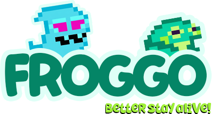

<div align="center">
  
  <h1>FROGGO: Better Stay Alive! 🐸</h1>
</div>

**FROGGO** is an advanced multi-agent reinforcement learning simulation where a **Hunter** agent learns to catch a **Prey** agent in a dynamic grid world. The project demonstrates the application of Deep Q-Networks (DQN), realistic perception systems (Raycasting), and strict software architecture principles. 


Thanks to the https://opengameart.org/ community for the art resources!

## Key Features

- **Deep Reinforcement Learning**: Agents utilize Deep Q-Networks (DQN) with Experience Replay and Target Networks to learn optimal strategies.
- **Realistic Perception**: The Hunter agent does not have "god mode". It uses **Raycasting** to detect walls and entities within its line of sight and maintains a **Memory** of the last known prey location.
- **Dynamic Gameplay**:
  - **Hunter**: Tracks scent trails, uses memory to investigate last seen locations, and learns to corner the prey.
  - **Prey**: Utilizes evasion tactics, including a "Dash" ability (double speed) and pallet consumption for points.
- **Clean Architecture**: The codebase is strictly organized into `Core` (Interfaces), `Shared` (Business Logic), and `Host` (UI/Entry) layers to ensure modularity and testability.
- **Retro UI**: A custom Pygame-based interface with real-time metrics, log console, and adjustable simulation speed.

## Project Structure


## Getting Started

### Prerequisites

- Python 3.8 or higher
- PyTorch
- Pygame
- NumPy

### Installation

1. Clone the repository:
   ```bash
   git clone https://github.com/yourusername/froggo-betterstayalive.git
   cd froggo-betterstayalive
   ```

2. Install dependencies:
   ```bash
   pip install torch pygame numpy
   ```

### Running the Simulation

To start the simulation, run the `main.py` file located in the `host` directory:

```bash
python host/main.py
```

## Controls

- **SPACE**: Pause / Resume the simulation.
- **ESC**: Exit the application.
- **Slider**: Drag the slider at the bottom of the sidebar to adjust the simulation speed (1x to 100x).

## Agent Logic

### The Hunter 
- **Goal**: Catch the prey by moving into the same cell.
- **Perception**: Can only see what is in its direct line of sight (Raycasting).
- **Memory**: Remembers where it last saw the prey and will investigate that location if the prey breaks line of sight.
- **Scent**: Can detect scent trails left by the prey to track it even without visual contact.

### The Prey 
- **Goal**: Survive as long as possible and collect pallets.
- **Abilities**:
  - **Dash**: Can move two cells in one turn (with a cooldown).
  - **Evasion**: Uses heuristic analysis to maximize distance from the hunter while avoiding corners.

## Training & Stats

- The system automatically saves training checkpoints to the `checkpoints/` directory.
- Episode statistics (steps, rewards, winner) are logged to `host/data/stats.json`.
- To reset training completely, delete the files in `checkpoints/` and `host/data/stats.json`.

---
*Developed as part of a University Project on Multi-Agent Systems and Software Architecture.*
